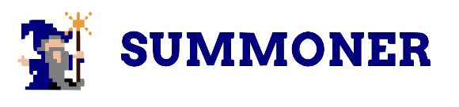

<p align="center">

</p>

# 🧱 Summoner Desktop

A modular Electron desktop app designed for rapid prototyping and collaboration.

## 📦 Features

- Clean login screen with customizable logo
- Modular landing page where each feature is its own folder
- Automatically generated buttons based on feature folders
- Elegant, minimal white UI with subtle gradients
- Designed for collaborative team workflows (main devs + interns)

---

## 🚀 Getting Started

This guide helps you set up and run the app locally, even if you’re new to Node.js or Electron.

---

### 🛠 1. Prerequisites: Install Node.js + npm

You’ll need **Node.js (v18 or later)** and **npm** (Node package manager). You can check if they're already installed:

```bash
node -v
npm -v
```

If either command is not found, install them:

#### 👉 macOS (recommended via [Homebrew](https://brew.sh)):

```bash
brew install node
```

#### 👉 Linux (Debian/Ubuntu):

```bash
sudo apt update
sudo apt install nodejs npm
```

> 💡 Tip: You can also use [nvm](https://github.com/nvm-sh/nvm) to manage multiple Node.js versions if you're working on different projects.

---

### 📦 2. Clone the repository

```bash
git clone https://github.com/Summoner-Network/summoner-desktop.git
cd summoner-desktop
```

---

### 📥 3. Install project dependencies

This installs Electron and other packages listed in `package.json`.

```bash
npm install
```

If you see a `package-lock.json` file appear — that's expected. It tracks exact versions of dependencies for reproducibility.

---

### 🧪 4. Start the app

```bash
npm start
```

You should see a desktop app open with a login screen. After logging in, you’ll be taken to the landing page.

---

### ✨ Preview

<p align="center">
  
</p>

<!-- <p align="center">
  <div style="display: inline-block; padding: 8px; background: white; border-radius: 10px; border: 1px solid #ccc; box-shadow: 0 4px 10px rgba(0,0,0,0.1);">
    
  </div>
</p> -->

---

## 🧩 Project Structure

```
renderer/
├── features/
│   ├── my-feature/
│   │   └── index.html
│   └── another-feature/
│       └── index.html
├── landing/
│   ├── landing.html
│   └── landing.js
├── login/
│   └── login.html
├── style.css
main.js
package.json
```

### 🔁 How It Works

- Every **folder inside `renderer/features/`** becomes a button on the landing page.
- Clicking a button loads that folder's `index.html`.
- The button name is the folder name (e.g. `quit`, `my-feature`, `analytics`).
- Special folders (like `quit`) can be treated uniquely in the routing logic.

---

## 👩‍💻 For Contributors

### ➕ Adding a Feature

To add a new top-level feature:

1. Create a new folder under `renderer/features/`
2. Add an `index.html` file (you can use the template below)
3. Restart the app — a new button will appear automatically on the landing page!

#### Example

```
renderer/features/user-dashboard/index.html
```

This will show a **"user-dashboard"** button on the landing page.

### 🌳 Adding a Subfeature

If you're collaborating as an intern or contributing a submodule, follow the same rule — just nest your folder under the appropriate parent:

```
renderer/features/user-dashboard/stats/index.html
```

You can then add routing logic to `user-dashboard/index.html` to handle navigation to its subfeatures.

---

## 🎨 Styling & Assets

- Shared styles live in `renderer/style.css`
- You can add images and logos under `renderer/assets/`
- Backgrounds and buttons use a white + light-gray palette with soft shadows

---

## 📌 Notes

- The app is frontend-only for now. No authentication or database logic has been implemented.
- All navigation is handled through static HTML files and JS.
- Designed to simulate the UX shell before plugging in backend logic.

---

## 📬 Contact

For questions or contributions, open an issue or tag a teammate in Slack.