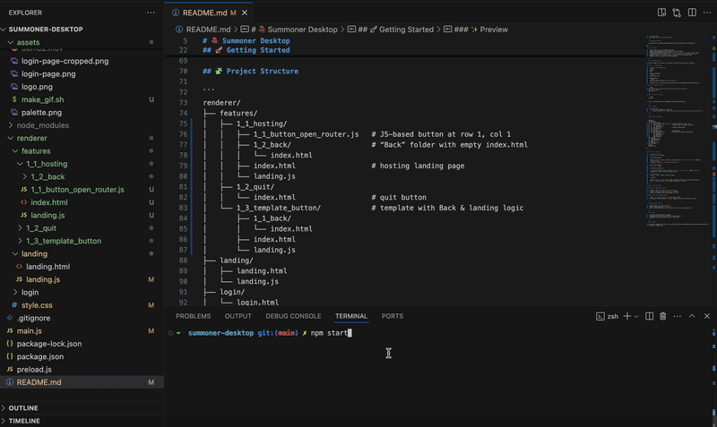

<p align="center">  
  
</p>

# 🧱 Summoner Desktop

A modular Electron desktop app designed for rapid prototyping and collaboration.

---

## 📦 Features

- Clean login screen with customizable logo  
- Modular landing page where each feature is its own folder  
- Automatically generated buttons based on **folder names** or **`button_*.js`** files  
- Coordinate-driven grid layout (e.g. `n_m_<feature-name>` for row *n*, column *m*)  
- Template folder (`1_3_template_button`) with built-in Back/landing logic  
- Elegant, minimal white UI with subtle gradients  

---

## 🚀 Getting Started

This guide helps you set up and run the app locally, even if you’re new to Node.js or Electron.

---

### 🛠 1. Prerequisites: Install Node.js + npm

You’ll need **Node.js (v18 or later)** and **npm** (Node package manager). You can check if they're already installed:

```bash
node -v
npm -v
```

If either command is not found, install them:

#### 👉 macOS (recommended via [Homebrew](https://brew.sh)):

```bash
brew install node
```

#### 👉 Linux (Debian/Ubuntu):

```bash
sudo apt update
sudo apt install nodejs npm
```

> 💡 Tip: You can also use [nvm](https://github.com/nvm-sh/nvm) to manage multiple Node.js versions if you're working on different projects.

---

### 📦 2. Clone the repository

```bash
git clone https://github.com/Summoner-Network/summoner-desktop.git
cd summoner-desktop
```

---

### 📥 3. Install project dependencies

This installs Electron and other packages listed in `package.json`.

```bash
npm install
```

If you see a `package-lock.json` file appear — that's expected. It tracks exact versions of dependencies for reproducibility.

---

### 🧪 4. Start the app

```bash
npm start
```

You should see a desktop app open with a login screen. After logging in, you’ll be taken to the landing page.

---

### ✨ Preview

<p align="center">  
    
</p>

---

## 🧩 Project Structure

```
renderer/
├── features/
│   ├── 1_1_hosting/
│   │   ├── 1_1_button_open_router.js   # JS-based button at row 1, col 1
│   │   ├── 1_2_back/                   # “Back” folder with empty index.html
│   │   │   └── index.html
│   │   ├── index.html                  # hosting landing page
│   │   └── landing.js
│   ├── 1_2_quit/
│   │   └── index.html                  # quit button
│   └── 1_3_template_button/            # template with Back & landing logic
│       ├── 1_1_back/
│       │   └── index.html
│       ├── index.html
│       └── landing.js
├── landing/
│   ├── landing.html
│   └── landing.js
├── login/
│   └── login.html
└── style.css
main.js
package.json
```

---

## 🔁 How It Works

1. **Folder → Button**  
   Any **directory** named  
   ```
   n_m_<feature-name>/
   ```  
   under `renderer/features/` produces a grid button at **row n**, **column m**, labeled `<feature-name>`.  
   Clicking it loads `n_m_<feature-name>/index.html`.

2. **JS File → Button**  
   Any **file** named  
   ```
   n_m_button_<action>.js
   ```  
   in a feature folder produces a button at **row n**, **column m**, labeled `<action>`.  
   Clicking it `require()`s and runs that script.

3. **Back Button**  
   To get a **Back** button, create a folder  
   ```
   n_m_back/
   ```  
   with an **empty** `index.html` inside. Clicking it returns to the main landing page.  
   The `1_3_template_button` folder shows this pattern in action.

---

## 👩‍💻 Contributing

### ➕ Add a Top-Level Feature

1. Create `renderer/features/n_m_<feature-name>/`  
2. Add an `index.html` (and `landing.js` if needed).  
3. Restart the app—your new button appears at (n,m).

### 🌳 Add a JS-Triggered Button

1. Place `n_m_button_<action>.js` in any feature folder.  
2. On launch, a button labeled `<action>` appears at (n,m) and executes your code.

---

## 🎨 Styling & Assets

- Shared styles in `renderer/style.css`  
- Assets (logo, demo.gif) in `assets/`  
- White + light-gray palette, soft shadows, and Inter or system-sans fonts  

---

## 📌 Notes

- Frontend only—no backend or database.  
- Navigation entirely via static HTML, JS, and Electron.  
- Designed to mock up UX before wiring in real logic.  

---

## 📬 Contact

Questions or suggestions? [Open an issue](https://github.com/Summoner-Network/summoner-desktop/issues) or ping the team on Slack.